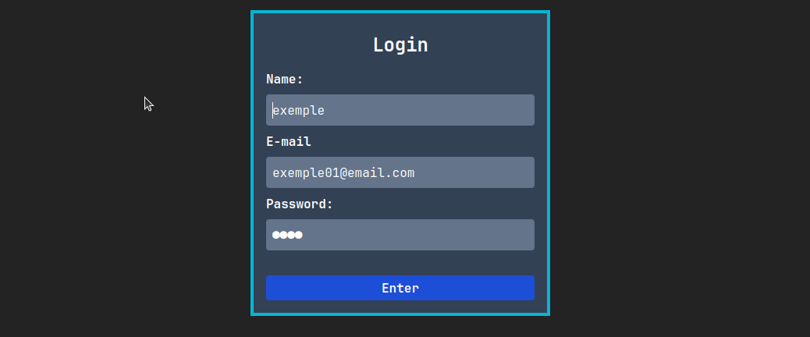

# Formulário com React, TypeScript, Tailwind CSS e React Hook Form

Este projeto é um formulário desenvolvido utilizando **React**, **TypeScript**, **Tailwind CSS** e **React Hook Form** para gerenciar e validar os dados do usuário de maneira eficiente.

## Tecnologias Utilizadas

- **React** - Biblioteca para construção de interfaces de usuário
- **TypeScript** - Superset do JavaScript que adiciona tipagem estática
- **Tailwind CSS** - Framework CSS utilitário para estilização rápida
- **React Hook Form** - Biblioteca para manipulação de formulários de forma otimizada

## Funcionalidades

- Validação de campos com mensagens de erro
- Gerenciamento eficiente do estado do formulário
- Estilização responsiva com Tailwind CSS
- Submissão de dados

## Instalação e Execução

1. Clone este repositório:
   ```bash
   git clone https://github.com/JonathanlimaDevSoftware/Fullstack_React_Vite.git
   ```
2. Acesse a pasta do projeto:
   ```bash
   cd form-react
   ```
3. Instale as dependências:
   ```bash
   npm install
   # ou
   yarn install
   ```
4. Execute o projeto:
   ```bash
   npm run dev
   # ou
   yarn dev
   ```

## Uso

Preencha os campos do formulário e clique no botão de envio. Caso algum campo esteja incorreto, mensagens de erro serão exibidas.

## Exemplo de Código





## Contribuição

Sinta-se à vontade para contribuir com melhorias, abrindo uma issue ou enviando um pull request.

## Licença

Este projeto está licenciado sob a **MIT License**.
