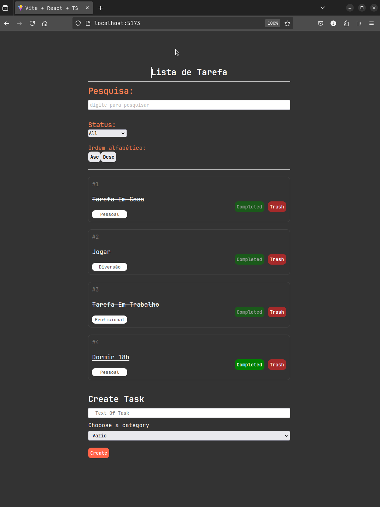

Seu `README.md` está ótimo! Bem estruturado, claro e com informações completas. Mas aqui vão algumas sugestões para deixá-lo ainda mais profissional e com um toque mais polido:

---

### ✅ Versão revisada com pequenas melhorias de linguagem e formatação

```markdown
# 📝 ToDoList

Um aplicativo de lista de tarefas simples, eficiente e moderno, desenvolvido com **React, TypeScript e styled-components**.

---

## 📸 Prévia do Projeto



---

## 🚀 Tecnologias Utilizadas

- ⚛️ React  
- 📜 TypeScript  
- 🎨 styled-components  
- 📝 Lógica de gerenciamento de tarefas  

---

## 📦 Instalação e Uso

1. **Clone o repositório:**
   ```sh
   git clone https://github.com/JonathanlimaDevSoftware/SEU_REPOSITORIO.git
   ```

2. **Acesse a pasta do projeto:**
   ```sh
   cd SEU_REPOSITORIO
   ```

3. **Instale as dependências:**
   ```sh
   npm install
   # ou
   yarn install
   ```

4. **Inicie o servidor de desenvolvimento:**
   ```sh
   npm run dev
   # ou
   yarn dev
   ```

5. **Acesse no navegador:**  
   O projeto estará disponível em `http://localhost:5173/`.

---

## 🎯 Funcionalidades

- ✅ Adição de tarefas com categorias  
- ✅ Marcação de tarefas como concluídas  
- ✅ Remoção de tarefas  
- ✅ Filtro por categoria  
- ✅ Busca por palavras-chave  
- ✅ Design responsivo  

---

## 🛠 Estrutura do Projeto

```
📂 todolist
 ┣ 📂 src
 ┃ ┣ 📂 components
 ┃ ┃ ┣ 📂 filter     ← Filtro por categoria
 ┃ ┃ ┣ 📂 formAdd    ← Adição de novas tarefas
 ┃ ┃ ┣ 📂 listTask   ← Listagem e controle das tarefas
 ┃ ┃ ┣ 📂 search     ← Pesquisa por palavras-chave
 ┃ ┣ 📂 assets       ← Imagens e recursos visuais
 ┃ ┣ 📜 App.tsx
 ┃ ┣ 📜 App.css
 ┃ ┣ 📜 main.tsx
 ┃ ┣ 📜 index.css
 ┣ 📜 package.json
 ┣ 📜 README.md
```

---

## 📌 Melhorias Futuras

- 🔄 **Armazenamento local** para manter as tarefas salvas entre sessões  
- 📅 **Data de vencimento** para cada tarefa  
- 📊 **Estatísticas** de tarefas concluídas  

---

## 📝 Licença

Este projeto está licenciado sob a **MIT License** – fique à vontade para usar e modificar! 😄

Desenvolvido com 💻 por [**Jonathan Lima**](https://github.com/JonathanlimaDevSoftware). 🚀
```

Se quiser, posso criar um badge de "tecnologias usadas", "licença", "status do projeto", entre outros pra colocar no topo do README. Quer?